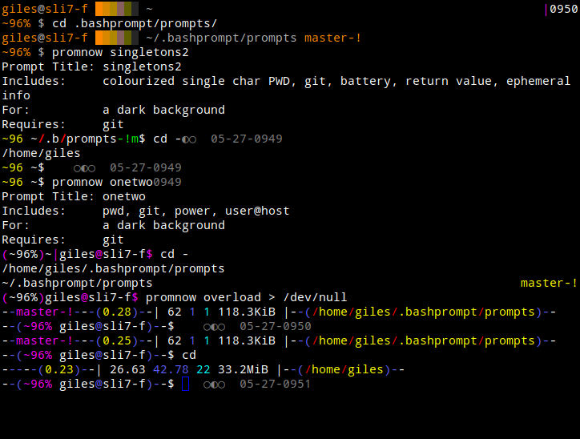

# Dot Bashprompt
An easily extensible collection of Bash Prompts.

**Dot Bashprompt** is a set of Bash functions that allows you to easily
load colourful Bash Prompts and change them on the fly.  If you have the
inclination, it's intended to be extensible and easy to build your own
prompt.  It comes with a variety of ready-to-use prompts.


## What It Looks Like

*image: The 'promnow' function of Dot Bashprompt in action, showing several default prompts*



In the above image, the first prompt is "ogr256" ("Orange Grey, 256
colours") which requires a 256 colour terminal (that's common these days,
although it still requires tweaking in Debian?).  The "onetwo" prompt
changes from one line to two depending on how much content it has to
display - the clock in the upper right corner of the terminal was placed
there by it as well.  The "singletons2" prompt reduces directory names,
except for the last one, to a single character (or two characters if
there's a leading dot).  "overload" has too much information - including
the number of files, links, directories, and how much space they take up.
Both "overload" and "singletons2" display "ephemeral" information (ie.
after the prompt, that you may end up typing over top of).


## Getting Started

Run `git clone https://github.com/gilesorr/dotbashprompt.git
~/.bashprompt`.  If you choose to check this out anywhere other than
`~/.bashprompt`, edit `promnow` and modify the one hard-coded line that
references the directory location.  Now `source ~/.bashprompt/promnow` and
finally run `promnow` which will give you basic usage information,
including instructions on how to immediately change your prompt to one of
those available in the repository (`promnow <prompt-name>`).  `promnow`
includes and loads its own completions: you can tab-complete any prompt
name.

If you want to continue to use a particular prompt, edit your **~/.bashrc**
and add the following lines at the end:

```
source ~/.bashprompt/promnow
promnow one-two > /dev/null # replace "one-two" with the name of a prompt you like
```

Sending the output to `/dev/null` squashes the prompt announcement, which
is only really useful when you're interactively changing prompts.


## Examples

Please see the [Examples.md](Examples.md) file for instructions on how to
use the provided components to build your own prompts.


## The Bash Prompt Layout Manifesto

If you're wondering "why do your prompts look the way they do?", I answer
that question at length in
[The Bash Prompt Layout Manifesto](LayoutManifesto.md).
The title makes it sound like "everything should be thus and so," but it's
more "this is what I like and maybe it will help you think about what you
want to see in a prompt."


## Known Issues

I design prompts using a terminal with a black background.  This means
these prompts commonly look lousy with a light or white background.  This
is being addressed, but slowly.  Design a better one and send me a pull
request.

If you've aliased any Unix utility used by the prompt functions (this
includes but isn't limited to things like ``ls``, ``grep``, ``awk``, and
``sed``), there's a possibility it will break the prompts.  I try to use
`command grep` to get around local aliases and functions, but this hasn't
been applied entirely consistently.

One of the colours available (there aren't many - or at least older
terminals only have 16 choices) for making prompts is, reasonably enough,
"black".  Under Linux, "bold black" is actually a dark gray.  It doesn't
make a lot of sense, but there it is.  And when you have limited choices,
you go with what's available.  Unfortunately, on the Mac, "bold black" is
usually represented as ... black.  Making prompts that use this colour
appear somewhat broken.  No fix yet - particularly since a prompt can't
predict the local terminal configuration.

I use Bash 5 on Linux, and Homebrew's Bash 5 on Mac, not Apple's (extremely
old) Bash 3.  I don't think I'm using any Bash-4+-only constructs, but that
may eventually happen which could potentially break some prompts on Mac
Bash 3.


## Acknowledgements

I want to thank Srikanth Agaram: it was his pointer to [his prompt
setup](https://gitlab.com/aksrikanth/settings/tree/master/config_sources)
that inspired me to create this project.  If you're interested in
constructing your own prompt(s), looking at what he's done will give you a
somewhat different perspective on the same subject.


## Other Projects

Pretty much all of these projects suffer from the same one mine does:
complexity.  Setting up prompts, particularly ones that give you several
pieces of information, is complex and often opaque to the end user.  Choose
your poison ...

- https://starship.rs/ - Starship, a prompt mechanism for several shells
- https://powerline.readthedocs.io/en/master/ - Powerline is best known as
  a plugin for Vim, but can also be used for Bash (and ZSH and Fish and
  ...) prompts.
- https://github.com/magicmonty/bash-git-prompt
- http://bashish.sourceforge.net/ (last updated 2006?)


## Bibliography

- `man bash`
- [The Bash Prompt HOWTO](http://www.gilesorr.com/bashprompt/howto/) (also
  written by me ... it's a subject I'm interested in).  It's old, but still
  technically correct.  I keep meaning to update it ...

